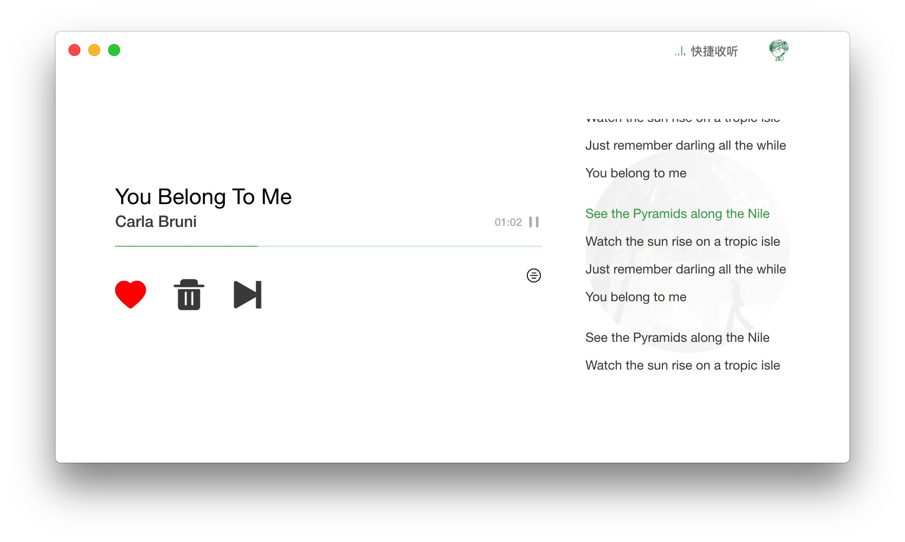
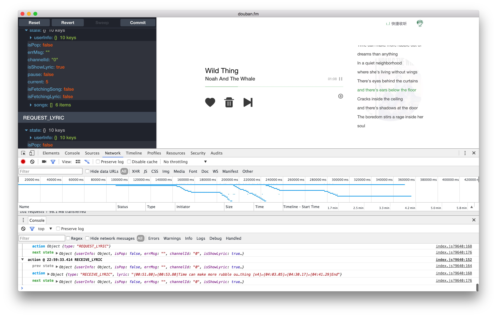

## PupaFM


[douban.fm](https://douban.fm) Music Desktop Player.

[](https://travis-ci.org/xwartz/PupaFM)
[](http://standardjs.com/)
[](https://david-dm.org/xwartz/PupaFM)
[](https://opensource.org/licenses/MIT)

### [中文说明](./README_ZH.md)

## based on


1. Framework: [Electron](http://electron.atom.io/)
2. Bundler: [Webpack](http://webpack.github.io/docs/),
[Babel](https://babeljs.io), 
[electron-builder](https://github.com/electron-userland/electron-builder)
3. Language: [ES2015](https://babeljs.io/docs/learn-es2015/), [Sass](http://sass-lang.com/)
4. Library: [React](https://facebook.github.io/react/), [Redux](https://github.com/reactjs/redux),
[React Router](https://github.com/reactjs/react-router),
[React Hot Loader](https://github.com/gaearon/react-hot-loader),
[Redux Thunk](https://github.com/gaearon/redux-thunk)
5. Lint: [ESLint](http://eslint.org/)

## Release Page
[Releases](https://github.com/xwartz/PupaFM/releases)

## Development



### Redux DevTools
See [redux-devtools-dock-monitor](https://github.com/gaearon/redux-devtools-dock-monitor) for more information.

### Install

First, clone the repo via git:

```bash
git clone git@github.com:xwartz/PupaFM.git
```

And then install dependencies.

```bash
$ cd PupaFM && npm i
```

### run

```bash
$ npm run hot-server
$ npm run hot-start
```

or enable watch with pm2 [eco.json](./eco.json)

```bash
$ npm start
$ npm stop
$ npm restart
```

## Package

```bash
$ npm run compile
$ npm run pack
```

or just run package

```bash
$ npm run package
```

## Build installer App

By default build for current platform and current arch.

```bash
$ npm run builder
```

Build app for Windows

```bash
$ npm run builder:win
```

Build app for Linux

```bash
$ npm run builder:linux
```


## Note
Before runing `package` or `builder`, you should read [electron-builder docs](https://github.com/electron-userland/electron-builder#readme) and checkout [Code Signing](https://github.com/electron-userland/electron-builder#code-signing)

## Contribution

Follow this [code style](./.eslintrc.js)

```bash
$ npm install
# install pre-commit lint hook
$ npm run install-hook
```

## License
MIT © [xwartz](https://github.com/xwartz)
